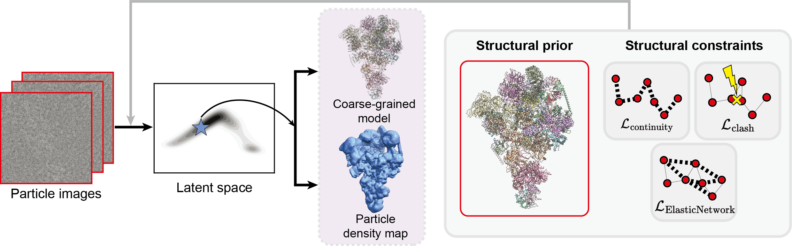

# CryoSTAR

`CryoSTAR` is a neural network based framework for recovering conformational heterogenity of protein complexes. By leveraging the structural prior and constraints from a reference `pdb` model, `cryoSTAR` can output both the protein structure and density map.



## Installation
Install requirements according to `requirements.txt`. Then install the base package cryostar by: `pip install -e .`

## Quick start

### Preliminary

You may need to prepare the resources below before running `cryoSTAR`:

- a concensus map (along with each particle's pose)
- a pdb file (which has been docked into the concensus map)

### Training
CryoSTAR runs two separate steps to train a atom generator and a density generator, following is an example:

1. train atom generator
```shell
cd projects/star
python train_atom.py atom_configs/10073.py
```

results will be saved to `work_dirs/atom_xxxxx`, we evaluate every 12k steps. In the directory, you can see directories with the name `epoch-number_step-number`, choose the latest directory as final results by default.
```text
atom_xxxxx/
├── 0000_0000000/
├── ...
├── 0112_0096000/        # evaluation results
│  ├── ckpt.pt          # model parameters
│  ├── input_image.png  # visualization of input cryo-EM images
│  ├── pca-1.pdb        # sampled coarse-grained atomic structures along 1st PCA axis
│  ├── pca-2.pdb
│  ├── pca-3.pdb
│  ├── pred.pdb         # sampled structures at Kmeans cluster centers
│  ├── pred_gmm_image.png
│  └── z.npy            # z corresponding to each particle，is a [num_of_particle, 8] matrix, this should be the input of the next step
├── yyyymmdd_hhmmss.log  # console logs
├── config.py            # experiment config
└── train_atom.py        # a backup for the script
```

2. train density generator
We use the $z$ assigned by step 1 as input, so change the input arguments `model.given_z` to the path of the latest z.npy here. Then run the following command to train a density generator.

```shell
# change the xxx/z.npy path to the output of the above command
python train_density.py density_configs/10073.py --cfg-options model.given_z=xxx/z.npy
```

results will be saved to `work_dirs/density_xxxxx`, we evaluate every 5 epoch. Results are also save in directories with the name `epoch-number_step-number`, choose the latest directory as final results by default.

```text
density_xxxxx\
├── 0004_0014470\          # evaluation results
│  ├── ckpt.pt            # model parameters
│  ├── vol_pca_1_000.mrc  # density sampled along PCA axis, named by vol_pca_pca-axis_serial-number.mrc
│  ├── ...
│  ├── vol_pca_3_009.mrc
│  ├── z.npy              # the given z, not changed
│  ├── z_pca_1.txt        # sampled z values along the 1st PCA axis
│  ├── z_pca_2.txt
│  └── z_pca_3.txt
├── yyyymmdd_hhmmss.log    # console logs
├── config.py              # experiment config
└── train_density.py       # a backup for the script
```


## Reference
You may cite this software by:
```bibtex
@article {Li2023cryostar,
    author = {Yilai Li and Yi Zhou and Jing Yuan and Fei Ye and Quanquan Gu},
    title = {CryoSTAR: Leveraging Structural Prior and Constraints for Cryo-EM Heterogeneous Reconstruction},
    elocation-id = {2023.10.31.564872},
    year = {2023},
    doi = {10.1101/2023.10.31.564872},
    URL = {https://www.biorxiv.org/content/early/2023/11/02/2023.10.31.564872},
    eprint = {https://www.biorxiv.org/content/early/2023/11/02/2023.10.31.564872.full.pdf},
    journal = {bioRxiv}
}
```